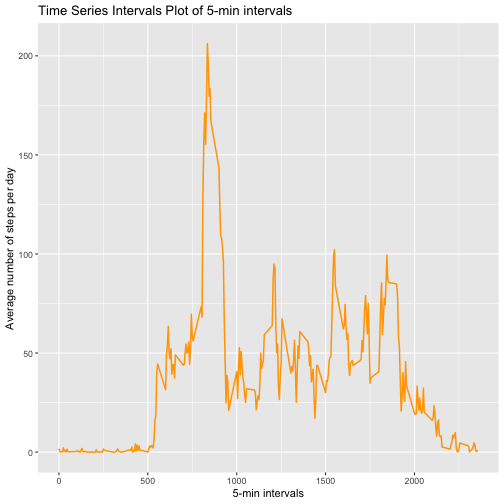

## Peer Assessment 1 

Loading the data


```r
activity <- read.table('activity.csv',sep = ",",header = TRUE, na.strings ="NA",
                    colClasses = c('integer','Date','factor'))
```


1. What is mean total number of steps taken per day?


```r
new.activity <- na.omit(activity)

total_steps <- aggregate(steps~date, data=new.activity, sum)

library(ggplot2)

plot1<- ggplot(new.activity, aes(date,steps)) + geom_bar(stat="identity", binwidth=.5) + 
  labs(title="Histogram of Total Number of Steps Taken Each Day", x="Date", 
       y="Total number of steps")
```

```
## Warning: Ignoring unknown parameters: binwidth
```

```r
print(plot1)
```


Mean and median of total number of steps 


```r
mean(total_steps$steps)
```

```
## [1] 10766.19
```

```r
median(total_steps$steps)
```

```
## [1] 10765
```


2. What is average daily activity pattern? 


```r
averages <- aggregate(new.activity$steps, list(as.numeric(as.character(new.activity$interval))), 
                      FUN=mean)

names(averages)[2]<- "Avg.Steps"
names(averages)[1]<- "interval"

plot2<- ggplot(averages, aes(interval, Avg.Steps)) + geom_line(color="orange", 
                  size=0.7) + labs(title="Time Series Intervals Plot of 5-min intervals",
                                   x="5-min intervals", y="Average number of steps per day")
print(plot2)
```



Maximum number of steps in 5-min interval across all dates


```r
averages[averages$Avg.Steps == max(averages$Avg.Steps),]
```

```
##     interval Avg.Steps
## 104      835  206.1698
```


3. Imputing missing values


```r
sum(!complete.cases(activity))
```

```
## [1] 2304
```

Imputing missing values by using mean for 5-min interval in new data set


```r
imp_activity <- activity 
for (i in 1:nrow(imp_activity)){
  if(is.na(imp_activity$steps[i])) {
    imp_activity$steps[i] <- averages[which(imp_activity$interval[i] == averages$interval),]$Avg.Steps
  }
}
```

Proof that missing values have been filles 


```r
sum(!complete.cases(imp_activity))
```

```
## [1] 0
```

Make a histogram of the total number of steps taken each day and Calculate and report the mean and median total number of steps taken per day. Do these values differ from the estimates from the first part of the assignment? What is the impact of imputing missing data on the estimates of the total daily number of steps?


```r
plot3 <- ggplot(imp_activity, aes(date, steps)) + geom_bar(stat="identity", binwidth=.5) +
        labs(title="Total Number of Steps Taken Each Day (Imputed Data)", x="Date", 
                    y="Total number of steps")
```

```
## Warning: Ignoring unknown parameters: binwidth
```

```r
print(plot3)
```


```r
total_steps_imp <- aggregate(steps~date, data=imp_activity, sum)

mean(total_steps_imp$steps)
```

```
## [1] 10766.19
```

```r
median(total_steps_imp$steps)
```

```
## [1] 10766.19
```

- The difference of imputing missing values is seen in the median which is equal to the mean in the imputed data set whereas its slightly lower than the mean in the original data set. 


4. Are there differences in activity patterns between weekdays and weekends?


```r
imp_activity$weekdays <- factor(format(imp_activity$date, "%A"))
levels(imp_activity$weekdays)
```

```
## [1] "Friday"    "Monday"    "Saturday"  "Sunday"    "Thursday"  "Tuesday"   "Wednesday"
```

```r
levels(imp_activity$weekdays) <- list(weekday = c("Monday", "Tuesday",
                                             "Wednesday", 
                                             "Thursday", "Friday"),
                                 weekend = c("Saturday", "Sunday"))

levels(imp_activity$weekdays)
```

```
## [1] "weekday" "weekend"
```

```r
new.averages <- aggregate(imp_activity$steps, 
                         list(interval = as.numeric(as.character(imp_activity$interval)), 
                              weekdays = imp_activity$weekdays),
                         FUN = "mean")

names(new.averages)[3] <- "Mean.Steps"

plot4<- ggplot(new.averages, aes(interval, Mean.Steps)) + geom_line(color="orange", size=0.7) + 
  facet_grid(rows=vars(weekdays)) + 
  labs(title="Average number of steps across week and weekend days", 
                                         x="Interval", y="Average")
print(plot4)
```


